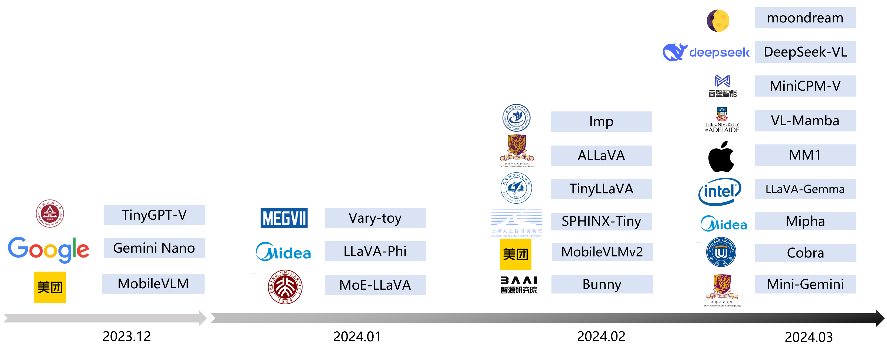
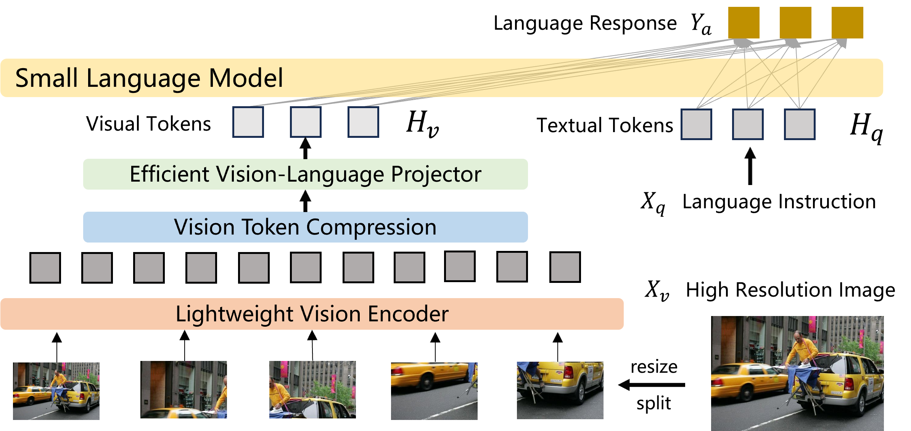

# Efficient-Multimodal-LLMs-Survey

> **[Efficient Multimodal Large Language Models: A Survey](https://arxiv.org/pdf/2405.10739v1)**[ [arXiv]](https://arxiv.org/pdf/2405.10739v1) 

> *Yizhang Jin<sup>12</sup>, Jian Li<sup>1</sup>, Yexin Liu<sup>3</sup>, Tianjun Gu<sup>4</sup>, Kai Wu<sup>1</sup>, Zhengkai Jiang<sup>1</sup>, Muyang He<sup>3</sup>, Bo Zhao<sup>3</sup>, Xin Tan<sup>4</sup>, Zhenye Gan<sup>1</sup>, Yabiao Wang<sup>1</sup>, Chengjie Wang<sup>1</sup>, Lizhuang Ma<sup>2</sup>*

> *<sup>1</sup>Tencent YouTu Lab, <sup>2</sup>SJTU, <sup>3</sup>BAAI, <sup>4</sup>ECNU*

**⚡We will actively maintain this repository and incorporate new research as it emerges. If you have any questions, please contact swordli@tencent.com. Welcome to collaborate on academic research and writing papers together.(学术合作，有兴趣写survey paper的也可以联系我)**. 

```
@misc{jin2024efficient,
      title={Efficient Multimodal Large Language Models: A Survey}, 
      author={Yizhang Jin and Jian Li and Yexin Liu and Tianjun Gu and Kai Wu and Zhengkai Jiang and Muyang He and Bo Zhao and Xin Tan and Zhenye Gan and Yabiao Wang and Chengjie Wang and Lizhuang Ma},
      year={2024},
      eprint={2405.10739},
      archivePrefix={arXiv},
      primaryClass={cs.CV}
}
```

## 📌 What is This Survey About?

<p align="center">
    
</p>


In the past year, Multimodal Large Language Models (MLLMs) have demonstrated remarkable performance in tasks such as visual question answering, visual understanding and reasoning. However, the extensive model size and high training and inference costs have hindered the widespread application of MLLMs in academia and industry. Thus, studying efficient and lightweight MLLMs has enormous potential, especially in edge computing scenarios. In this survey, we provide a comprehensive and systematic review of the current state of efficient MLLMs. Specifically, we summarize the timeline of representative efficient MLLMs, research state of efficient structures and strategies, and the applications. Finally, we discuss the limitations of current efficient MLLM research and promising future directions.

<p align="center">
    
</p>

###  Summary of 17 Mainstream Efficient MMLMs

| Model | Vision Encoder | Resolution | Vision Encoder Parameter Size | LLM | LLM Parameter Size | Vision-LLM Projector | Timeline |
|-------|----------------|------------|------------------------------|-----|----------------|----------------------|----------|
| MobileVLM  | CLIP ViT-L/14  | 336 | 0.3B | MobileLLaMA  | 2.7B | LDP | 2023-12 |
| LLaVA-Phi  | CLIP ViT-L/14  | 336 | 0.3B | Phi-2  | 2.7B | MLP | 2024-01|
| Imp-v1| SigLIP  | 384 | 0.4B | Phi-2  | 2.7B | - | 2024-02 |
| TinyLLaVA  | SigLIP-SO  | 384 | 0.4B | Phi-2  | 2.7B | MLP | 2024-02 |
| Bunny | SigLIP-SO | 384 | 0.4B | Phi-2  | 2.7B | MLP | 2024-02 |
| MobileVLM-v2-3B | CLIP ViT-L/14  | 336 | 0.3B | MobileLLaMA  | 2.7B | LDPv2  | 2024-02 |
| MoE-LLaVA-3.6B  | CLIP-Large  | 384 | - | Phi-2  | 2.7B | MLP | 2024-02 |
| Cobra | DINOv2, SigLIP-SO  | 384 | 0.3B+0.4B | Mamba-2.8b-Zephyr | 2.8B | MLP | 2024-03 |
| Mini-Gemini | CLIP-Large  | 336 | - | Gemma  | 2B | MLP | 2024-03 |
| Vary-toy  | CLIP  | 224 | - | Qwen  | 1.8B | - | 2024-01 |
| TinyGPT-V  | EVA  | 224/448 | - | Phi-2  | 2.7B | Q-Former  | 2024-01 |
| SPHINX-Tiny  | DINOv2 , CLIP-ConvNeXt  | 448 | - | TinyLlama  | 1.1B | - | 2024-02 |
| ALLaVA-Longer  | CLIP-ViT-L/14  | 336 | 0.3B | Phi-2  | 2.7B | - | 2024-02 |
| MM1-3B-MoE-Chat  | CLIP_DFN-ViT-H  | 378 | - | - | 3B | C-Abstractor  | 2024-03 |
| LLaVA-Gemma  | DinoV2  | - | - | Gemma-2b-it  | 2B | - | 2024-03 |
| Mipha-3B  | SigLIP  | 384 | - | Phi-2  | 2.7B | - | 2024-03 |
| VL-Mamba | SigLIP-SO  | 384 | - | Mamba-2.8B-Slimpj  | 2.8B | VSS-L2  | 2024-03 |
| MiniCPM-V 2.0  | SigLIP  | - | 0.4B | MiniCPM  | 2.7B | Perceiver Resampler  | 2024-03 |
| DeepSeek-VL  | SigLIP-L  | 384 | 0.4B | DeepSeek-LLM  | 1.3B | MLP | 2024-03 |
| KarmaVLM  | SigLIP-SO  | 384 | 0.4B | Qwen1.5  | 0.5B | - | 2024-02 |
| moondream2  | SigLIP  | - | - | Phi-1.5  | 1.3B | - | 2024-03 |
| Bunny-v1.1-4B  | SigLIP  | 1152 | - | Phi-3-Mini-4K  | 3.8B | - | 2024-02 |


## Efficient MLLMs

### Architecture
- Mobilevlm: A fast, reproducible and strong vision language assistant for mobile devices. <ins>arXiv, 2023</ins> [[Paper](https://arxiv.org/abs/2312.16886)] 
- Llava-phi: Efficient multi-modal assistant with small language model. <ins>arXiv, 2024</ins> [[Paper](https://arxiv.org/abs/2401.02330)] 
- Imp-v1: An emprical study of multimodal small language models. <ins>arXiv, 2024</ins> [[Paper](https://arxiv.org/abs/2405.12107)]
- TinyLLaVA: A Framework of Small-scale Large Multimodal Models. <ins>arxiv, 2024</ins> [[Paper](https://arxiv.org/abs/2402.14289)] 
- (Bunny)Efficient multimodal learning from data-centric perspective.<ins>arXiv, 2024</ins> [[Paper](https://arxiv.org/abs/2402.11530)] 
- Gemini: a family of highly capable multimodal models<ins>arXiv, 2023</ins> [[Paper](https://arxiv.org/abs/2312.11805)] 
- Mobilevlm v2: Faster and stronger baseline for vision language model. <ins>arXiv, 2024</ins> [[Paper](https://arxiv.org/abs/2402.0376)] 
- Moe-llava: Mixture of experts for large vision-language models. <ins>arXiv, 2024</ins> [[Paper](https://arxiv.org/abs/2401.15947)] 
- Cobra:Extending mamba to multi-modal large language model for efficient inference. <ins>arXiv, 2024</ins> [[Paper](https://arxiv.org/abs/2403.14520)] 
- Mini-gemini: Mining the potential of multi-modality vision language models. <ins>arXiv, 2024</ins> [[Paper](https://arxiv.org/abs/2403.18814)] 
- (Vary-toy)Small language model meets with reinforced vision vocabulary. <ins>arXiv, 2024</ins> [[Paper](https://arxiv.org/abs/2401.12503)] 
- Tinygpt-v: Efficient multimodal large language model via small backbones.<ins>arXiv, 2023</ins> [[Paper](https://arxiv.org/abs/2312.16862)] 
- SPHINX-X: Scaling Data and Parameters for a Family of Multi-modal Large Language Models.<ins>arXiv, 2024</ins> [[Paper](https://arxiv.org/abs/2402.05935)] 
- ALLaVA: Harnessing GPT4V-synthesized Data for A Lite Vision-Language Model.<ins>arXiv, 2024</ins> [[Paper](https://arxiv.org/abs/2402.11684)] 
- Mm1: Methods, analysis \& insights from multimodal llm pre-training.<ins>arXiv, 2024</ins> [[Paper](https://arxiv.org/abs/2403.09611)] 
- LLaVA-Gemma: Accelerating Multimodal Foundation Models with a Compact Language Model.<ins>arXiv, 2024</ins> [[Paper](https://arxiv.org/abs/2404.01331)] 
- Mipha: A Comprehensive Overhaul of Multimodal Assistant with Small Language Models.<ins>arXiv, 2024</ins> [[Paper](https://arxiv.org/abs/2403.06199)] 
- VL-Mamba: Exploring State Space Models for Multimodal Learning.<ins>arXiv, 2024</ins> [[Paper](https://arxiv.org/abs/2403.13600)] 
- MiniCPM-V 2.0: An Efficient End-side MLLM with Strong OCR and Understanding Capabilities.<ins>github, 2024</ins> [[Github](https://github.com/OpenBMB/MiniCPM-V)] 
- DeepSeek-VL: Towards Real-World Vision-Language Understanding
.<ins>arXiv, 2024</ins> [[Paper](https://arxiv.org/abs/2403.05525)] 
- KarmaVLM: A family of high efficiency and powerful visual language model.<ins>github, 2024</ins> [[Github](https://github.com/thomas-yanxin/KarmaVLM)] 
- moondream: tiny vision language model.<ins>github, 2024</ins> [[Github](https://github.com/vikhyat/moondream)] 


#### Vision Encoder

##### Multiple Vision Encoders
- Broadening the visual encoding of vision-language models, <ins>arXiv, 2024</ins> [[Paper](https://arxiv.org/abs/2404.07204)] 
- Cobra: Extending Mamba to Multi-Modal Large Language Model for Efficient Inference, <ins>arXiv, 2024</ins> [[Paper](https://arxiv.org/abs/2403.14520)] 
- SPHINX-X: Scaling Data and Parameters for a Family of Multi-modal Large Language Models, <ins>arXiv, 2024</ins> [[Paper](https://arxiv.org/abs/2402.05935)] 

##### Lightweight Vision Encoder
- ViTamin: Designing Scalable Vision Models in the Vision-Language Era. <ins>arXiv, 2024</ins> [[Paper](https://arxiv.org/abs/2404.02132)] 

#### Vision-Language Projector

##### MLP-based
- Visual Instruction Tuning. <ins>arXiv, 2023</ins> [[Paper](https://arxiv.org/abs/2304.08485)] 
- Improved baselines with visual instruction tuning. <ins>arXiv, 2023</ins> [[Paper](https://arxiv.org/abs/2310.03744)] 
- TokenPacker: Efficient Visual Projector for Multimodal LLM. <ins>arXiv, 2024</ins> [[Paper](https://arxiv.org/abs/2407.02392)] 

##### Attention-based
- Flamingo: a Visual Language Model for Few-Shot Learning, <ins>arXiv, 2022</ins> [[Paper](https://arxiv.org/abs/2204.14198)] 
- BLIP-2: Bootstrapping Language-Image Pre-training with Frozen Image Encoders and Large Language Models, <ins>arXiv, 2023</ins> [[Paper](https://arxiv.org/abs/2301.12597)] 
- Broadening the visual encoding of vision-language models, <ins>arXiv, 2024</ins> [[Paper](https://arxiv.org/abs/2404.07204)] 

##### CNN-based
- MobileVLM V2: Faster and Stronger Baseline for Vision Language Model, <ins>arXiv, 2023</ins> [[Paper](https://arxiv.org/abs/2402.03766)] 
- Mobilevlm: A fast, reproducible and strong vision language assistant for mobile devices. <ins>arXiv, 2023</ins> [[Paper](https://arxiv.org/abs/2312.16886)] 

##### Mamba-based
- Vl-mamba: Exploring state space models for multimodal learning.<ins>arXiv, 2024</ins> [[Paper](https://arxiv.org/abs/2403.13600)] 

##### Hybrid Structure
- Honeybee: Locality-enhanced projector for multimodal llm.<ins>arXiv, 2023</ins> [[Paper](https://arxiv.org/abs/2312.06742)] 

#### Small Language Models
- Llama: Open and efficient foundation language models. <ins>arXiv, 2023</ins> [[Paper](https://arxiv.org/abs/2302.13971)] 
- Vicuna: An open-source chatbot impressing gpt-4 with 90\%* chatgpt quality.<ins>website, 2023</ins> [[web](https://vicuna. lmsys. org)] 
- Phi-2: The surprising power of small language models. <ins>blog 2023</ins> [[blog](Microsoft Research Blog)] 
- Gemma: Open models based on gemini research and technology. <ins>arXiv, 2024</ins> [[Paper](https://arxiv.org/abs/2403.08295)] 
- Phi-3 technical report: A highly capable language model locally on your phone. <ins>2024</ins> 

#### Vision Token Compression

##### Multi-view Input
- Llava-uhd: an lmm perceiving any aspect ratio and high-resolution images. <ins>arXiv, 2024</ins> [[Paper](https://arxiv.org/abs/2403.11703)] 
 - A pioneering large vision- language model handling resolutions from 336 pixels to 4k hd.  <ins>arXiv, 2024</ins> [[Paper](https://arxiv.org/abs/2404.06512)] 

##### Token processing
- Llava-uhd: an lmm perceiving any aspect ratio and high-resolution images. <ins>arXiv, 2024</ins> [[Paper](https://arxiv.org/abs/2403.11703)] 
- Texthawk: Exploring efficient fine-grained perception of multimodal large language models. <ins>arXiv, 2024</ins> [[Paper](https://arxiv.org/abs/2404.09204)] 
- Tiny- chart: Efficient chart understanding with visual token merging and program-of-thoughts learning.
- Llava-prumerge: Adaptive token reduction for efficient large multimodal models. <ins>arXiv, 2024</ins> [[Paper](https://arxiv.org/abs/2403.15388)] 
- Madtp: Multi- modal alignment-guided dynamic token pruning for accelerating vision-language transformer. <ins>arXiv, 2024</ins> [[Paper](https://arxiv.org/abs/2403.02991)] 
- CROSSGET: CROSS-GUIDED ENSEMBLE OF TOKENS FOR ACCELERATING VISION-LANGUAGE TRANSFORMERS. <ins>ICML, 2024</ins> [[Paper](https://arxiv.org/pdf/2305.17455)]
- Matryoshka Query Transformer for Large Vision-Language Models. <ins>arxiv, 2024</ins> [[Paper](https://arxiv.org/pdf/2405.19315)]


##### Multi-Scale Information Fusion
- Mini-gemini: Mining the potential of multi-modality vision language models. <ins>arXiv, 2024</ins> [[Paper](https://arxiv.org/abs/2403.18814)] 
- When do we not need larger vision models? <ins>arXiv, 2024</ins> [[Paper](https://arxiv.org/abs/2403.13043)] 
<ins>arXiv, 2023</ins> [[Paper](https://arxiv.org/abs/2302.13971)] 

##### Vision Expert Agents
- Plug-and-play grounding of reasoning in multimodal large language models. <ins>arXiv, 2024</ins> [[Paper](https://arxiv.org/abs/2403.19322)] 
- Mova: Adapting mixture of vision experts to multimodal context. <ins>arXiv, 2024</ins> [[Paper](https://arxiv.org/abs/2404.13046)] 

##### Video-Specific Methods
- Elysium: Exploring object-level perception in videos via mllm. <ins>arXiv, 2024</ins> [[Paper](https://arxiv.org/abs/2403.16558)] 
- Extending video-language pretraining to n-modality by language-based semantic alignment. <ins>arXiv, 2023</ins> [[Paper](https://arxiv.org/abs/2310.01852)] 
- Video-llava: Learning united visual representation by alignment before projection. <ins>arXiv, 2023</ins> [[Paper](https://arxiv.org/abs/2311.10122)] 

#### Efficient Structures
##### Mixture of Experts
- Moe-llava: Mixture of experts for large vision-language models. <ins>arXiv, 2024</ins> [[Paper](https://arxiv.org/abs/2401.15947)] 
- Mm1: Methods, analysis & insights from multimodal llm pre-training. <ins>arXiv, 2024</ins> [[Paper](https://arxiv.org/abs/2403.09611)] 
- Mixtral of experts. <ins>arXiv, 2024</ins> [[Paper](https://arxiv.org/abs/2401.04088)] 

##### Mamba
- Cobra: Extending Mamba to Multi-Modal Large Language Model for Efficient Inference, <ins>arXiv, 2024</ins> [[Paper](https://arxiv.org/abs/2403.14520)] 
- Mamba: Linear-time sequence modeling with selective state spaces. <ins>arXiv, 2023</ins> [[Paper](https://arxiv.org/abs/2312.00752)] 
- Vl-mamba: Exploring state space models for multimodal learning. <ins>arXiv, 2024</ins> [[Paper](https://arxiv.org/abs/2403.13600)] 

##### Inferece Acceleration
- On speculative decoding for multimodal large language models. <ins>arXiv, 2024</ins> [[Paper](https://arxiv.org/abs/2404.08856)] 
- An image is worth 1/2 tokens after layer 2: Plug-and-play inference acceleration for large vision-language models. <ins>arXiv, 2024</ins> [[Paper](https://arxiv.org/abs/2403.06764)] 
- Boosting multimodal large language models with visual tokens withdrawal for rapid inference. <ins>arXiv, 2024</ins> [[Paper](https://arxiv.org/abs/2405.05803)] 


### Training

#### Pre-Training

##### Which part to unfreeze
- Tinyllava: A framework of small-scale large multimodal models. <ins>arXiv, 2024</ins> [[Paper](https://arxiv.org/abs/2402.14289)] 
- Vila: On pre-training for visual language models. <ins>arXiv, 2023</ins> [[Paper](https://arxiv.org/abs/2312.07533)] 
- Sharegpt4v: Improving large multi-modal models with better captions. <ins>arXiv, 2023</ins> [[Paper](https://arxiv.org/abs/2311.12793)] 

##### Multi-stage pre-training
- What matters when building vision- language models? <ins>arXiv, 2024</ins> [[Paper](https://arxiv.org/abs/2405.02246)] 

#### Instruction-Tunining
##### Efficient IT
- Cheap and quick: Efficient vision-language instruction tuning for large language models. <ins>nips, 2023</ins> [[Paper](https://proceedings.neurips.cc/paper_files/paper/2023/file/5e84e4413268b713f0d4a1b23a9dae57-Paper-Conference.pdf)]
- Hyperllava: Dynamic visual and language expert tuning for multimodal large language models. <ins>arXiv, 2024</ins> [[Paper](https://arxiv.org/abs/2403.13447)]

#### Diverse Training Steps
- SPHINX-X: Scaling Data and Parameters for a Family of Multi-modal Large Language Models.<ins>arXiv, 2024</ins> [[Paper](https://arxiv.org/abs/2402.05935)] 
- Cobra:Extending mamba to multi-modal large language model for efficient inference. <ins>arXiv, 2024</ins> [[Paper](https://arxiv.org/abs/2403.14520)] 
- Tinygpt-v: Efficient multimodal large language model via small backbones.<ins>arXiv, 2023</ins> [[Paper](https://arxiv.org/abs/2312.16862)] 

#### Parameter Efficient Transfer Learning
- Not All Attention is Needed: Parameter and Computation Efficient Transfer Learning for Multi-modal Large Language Models. <ins>arXiv, 2024</ins> [[Paper](https://arxiv.org/abs/2403.15226)] 
- Memory-space visual prompting for efficient vision-language fine-tuning. <ins>arXiv, 2024</ins> [[Paper](https://arxiv.org/abs/2405.05615)]

### Applications

#### Biomedical Analysis
- Training small multimodal models to bridge biomedical competency gap: A case study in radiology imaging. <ins>arXiv, 2024</ins> [[Paper]]
- Moe-tinymed: Mixture of experts for tiny medical large vision-language models. <ins>arXiv, 2024</ins> [[Paper](https://arxiv.org/abs/2404.10237)] 

#### Document Understanding
- Texthawk: Exploring efficient fine-grained perception of multimodal large language models. <ins>arXiv, 2024</ins> [[Paper](https://arxiv.org/abs/2404.09204)]
- Tiny- chart: Efficient chart understanding with visual token merging and program-of-thoughts learning. <ins>arXiv, 2024</ins> [[Paper](https://arxiv.org/abs/2404.16635)]
- Monkey: Image resolution and text label are important things for large multi-modal models. <ins>arXiv, 2024</ins> [[Paper](https://arxiv.org/abs/2404.06918)]
- Hrvda: High-resolution visual document assistant. <ins>arXiv, 2023</ins> [[Paper](https://arxiv.org/abs/2311.06607)]

#### Video Comprehension
- mplug-2: A modular- ized multi-modal foundation model across text, image and video. <ins>arXiv, 2023</ins> [[Paper](https://arxiv.org/abs/2302.00402)]
- Video-llava: Learning united visual representation by alignment before projection. <ins>arXiv, 2023</ins> [[Paper](https://arxiv.org/abs/2311.10122)]
- Ma-lmm: Memory-augmented large multimodal model for long-term video under- standing. <ins>arXiv, 2024</ins> [[Paper](https://arxiv.org/abs/2404.05726)]
- Llama-vid: An image is worth 2 tokens in large language models. <ins>arXiv, 2023</ins> [[Paper](https://arxiv.org/abs/2311.17043 )]
